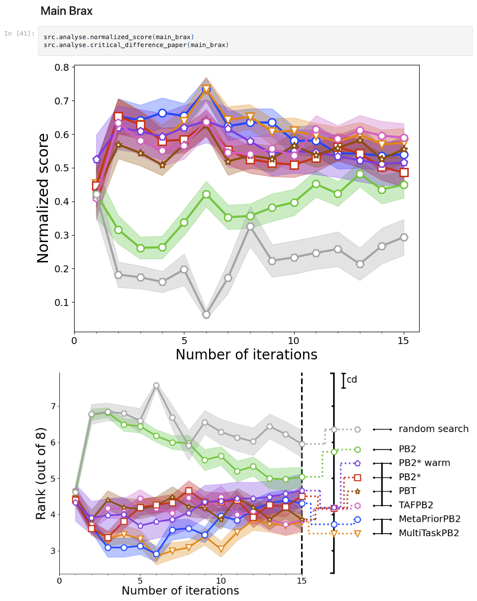

# Code for Meta-learning Population-based Methods for Reinforcement Learning
This repository contains the official code for our paper. 
We present four methods which extend PB2 with meta-learning. 
These methods and relevant baselines were evaluated and compared on two families of Reinforcement Learning environments.


# Installation
## Conda
From the main directory execute the following commands to create a conda environment and install the required packages.
```bash
conda create --name meta-pb2 python=3.9
conda activate meta-pb2
pip install -r requirements.txt
```
## Singularity
Install singularity following the official [instructions](https://docs.sylabs.io/guides/latest/user-guide/quick_start.html#quick-installation-steps).
Build a container from the provided definition file
```bash
sudo singularity build singularity.sif singularity.def
```
Run code with singularity
```bash
singularity exec --nv -H <path to the main directory> singularity.sif python <python file> <arguments>
```

## Data Download
The data containing the results of our experiments and the meta-data used by our methods can be downloaded from <https://figshare.com/s/1c02110b4a7505be7ad8>. 
After downloading the files, extract them in the root directory of this repository.
Note that `meta_data.zip` contains the meta-data used by our methods and `results.zip` contains the results of our experiments.
# Usage
The experiments can be reproduced by running the configuration files in the `configurations` directory with the following command.
```bash
python -m src.run_experiment --moab_id 0 --config_file_name pb2 --experiment_dir configurations/examples
```
The `--moab_id` argument specifies which environment and seed will be chosen.

We also provided examples how to use our methods in your own setup in the `examples` directory.
## Creating Meta-Data
The methods introduced in this paper use two different types of meta-data. One type are portfolios which are used 
to initialize the hyperparameters. The other is in the form of previous runs which are used to update the hyperparameters.

### Portfolios
Creating portfolios is done in three steps as described in Section 4.4 of our paper. 

We created a small example [configuration](configurations/examples/portfolio_example.py) which only contains 2 environments with two gravity variants to demonstrate the process. 
The following commands can be used to generate the portfolios.

The first step is to generate portfolio candidates by finding optimal hyperparameter configurations for all environments by running:
```bash
for id in {0..3}
do
  python -m src.generate_starting_regions --moab_id $id --config_file_name portfolio --experiment_dir configurations/examples --max_concurrent 4 --n_best_configs 1
done
```
The second step reruns the best configurations on each environment to later create a performance matrix.
```bash
for id in {0..15}
do
  python -m src.rerun_starting_regions --moab_id 0 --config_file_name portfolio --initial_configs_save_dir ray_results/examples/portfolio/initial_configs --experiment_dir configurations/examples
done
```
The last step creates the portfolio by running the following command.
```bash
python -m src.generate_portfolio --initial_regions_save_dir ray_results/examples/portfolio/initial_configs  --portfolio_size 2
```


### Previous Runs
Set the `--meta_data` flag when running an experiment to save the results in a way that can be used by the meta-learning methods.
```bash
python -m src.run_experiment --moab_id 0 --config_file_name pb2 --experiment_dir configurations_classic_control --save_meta
```


## Evaluation
The downloaded (see [Data Download](#data-download)) or newly generated (see [Creating Meta-Data](#creating-meta-data)) results can be interactively visualized in the [`visualizations.ipynb`](visualizations.ipynb) notebook.



# Citing
If you use MetaPB2 in your work, please cite the following paper:
```bibtex
@article{
    hog2025metalearning,
    title={Meta-learning Population-based Methods for Reinforcement Learning},
    author={Johannes Hog and Raghu Rajan and André Biedenkapp and Noor Awad and Frank Hutter and Vu Nguyen},
    journal={Transactions on Machine Learning Research},
    issn={2835-8856},
    year={2025},
    url={https://openreview.net/forum?id=d9htascfP8},
    note={}
}
```